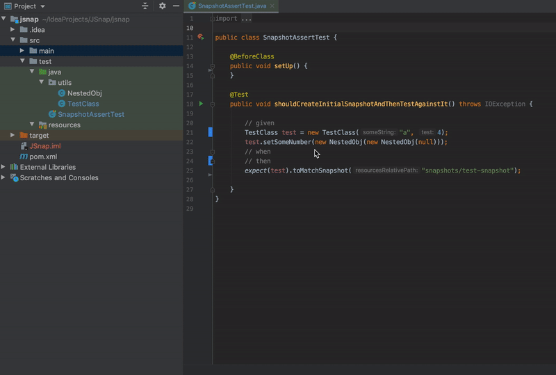
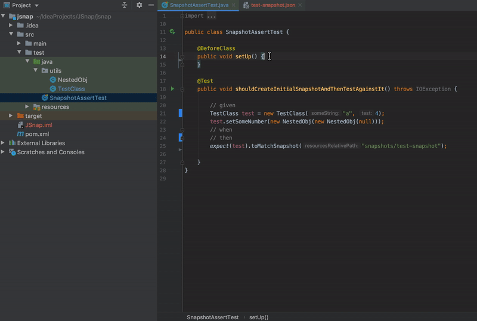

# JSnap
Snapshot testing library made for java. 
Inspired by my frontend colleague. Let me quote "Seriously Do you really write all those assertions? Don't you have [Jest in java](https://jestjs.io/)
### Maven release
[](https://jitpack.io/#michaelloo35/Jest4J)

It is:
* Simple
* Framework agnostic
* Lightweight
* Verbose
* Zero config ( well optionally you can write single line of configuration that will make your life helluva better

## How to use it:
1. Import the library
```java
import com.github.michaelloo35.jsnap.SnapshotAssertConfiguration;
```
2. (Optional) Configure path to resources directory relative to project root.
   With this one line of configuration your error messages will be nicely clickable.
   For single module maven project that would be:
```java
SnapshotAssertConfiguration.setMavenModuleRelativeResourcesPath("/src/test/resources/");
```
3. Write some assertions
```java
expect(actual).toMatchSnapshot("snapshotFileNameGoesHere");
```
After running the test for the first time snapshot file will be generated under execution/current directory.
This file should be verified and moved to resources:


From now on the test will assert actual against the snapshot and point out any differences or pass if there are any.

